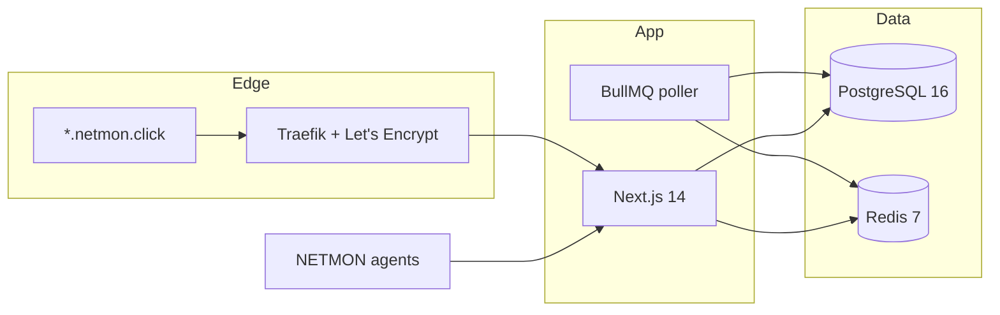

# NETMON

**Your Network, Always On.**

Enterprise-grade Network Monitoring System (NMS) for **on-premise** and **Cloud SaaS**. Monitor devices, alerts, SLA, and topology from a single dark-mode console — with full tenant isolation.

[](https://nextjs.org)
[](https://www.prisma.io)
[](https://www.postgresql.org)
[](https://redis.io)
[](#license)

| | |
| --- | --- |
| **Product** | [netmon.click](https://netmon.click) |
| **Tenant URL** | `{slug}.netmon.click` |
| **Cloud host** | `103.190.214.224` |
| **Tagline** | Click to Monitor Everything · Enterprise Network Visibility |

---

## Why NETMON

Most NMS tools are either too heavy for a single site or too weak for multi-tenant SaaS. NETMON is built for both:

- **Cloud SaaS** — wildcard DNS, Traefik + Let’s Encrypt, one cluster for every customer
- **On-premise** — Docker Compose on the customer’s server, no Traefik required
- **Tenant isolation** — every query is scoped by `tenant_id`
- **Role-based access** — `superadmin`, `admin`, `operator`, `viewer`

---

## Features

| # | Module | Path | Description |
| ---: | --- | --- | --- |
| 1 | Poller | worker | TCP health checks, metrics, auto-alert |
| 2 | Alert | `/dashboard/alerts` | Firing / resolved events with severity |
| 3 | SLA | `/dashboard/sla` | 30-day uptime per device |
| 4 | Topology | `/dashboard/topology` | Live device-link map |
| 5 | Import | `/dashboard/import` | CSV / Excel inventory upload |
| 6 | Bulk actions | `/dashboard/devices` | Multi-select mark / delete |
| 7 | Report PDF | `/dashboard/reports` | Operations report export |
| 8 | Status page | `/status/[tenant]` | Public tenant status |
| 9 | Security | `/dashboard/security` | TOTP 2FA + SSO draft |
| 10 | Agent | `/dashboard/agents` | Token enroll + heartbeat API |
| 11 | Dashboard builder | `/dashboard/dashboards` | JSON widget layouts |
| 12 | Customer portal | `/portal` | Read-only viewer console |
| 13 | Users | `/dashboard/users` | Invite and assign roles |
| 14 | Onboarding | `/signup` | Self-serve tenant creation |
| 15 | Superadmin | `/admin` | All tenants, plans, limits |

---

## Architecture



**Stack:** Next.js 14 · Prisma · PostgreSQL 16 · Redis 7 · BullMQ · Traefik · Tailwind CSS · shadcn/ui · Framer Motion · NextAuth

---

## Quick start (local)

Requires Node 20+, Docker, and npm.

```bash
git clone https://github.com/bontiharyanto/netmon.git
cd netmon
cp .env.example .env

docker compose -f docker-compose.dev.yml up -d
npm install
npx prisma migrate deploy
npm run db:seed
npm run dev
```

Open [http://localhost:3000](http://localhost:3000)

| Account | Email | Password | Role |
| --- | --- | --- | --- |
| Console | `admin@netmon.click` | `ChangeMeNow!` | superadmin |
| Portal | `viewer@demo.netmon.click` | `ChangeMeNow!` | viewer |

Change these before any public deploy.

Poller worker (separate process):

```bash
npm run worker
```

---

## Deployment

### Cloud SaaS

File: `docker-compose.cloud.yml`

1. Point DNS at the server (`103.190.214.224`):

   ```
   A     @      103.190.214.224
   A     *      103.190.214.224
   CNAME www    netmon.click
   ```

2. Open firewall ports **80** and **443**.
3. Copy `.env.example` → `.env` and set production secrets.
4. Bring the stack up:

   ```bash
   docker compose -f docker-compose.cloud.yml up -d --build
   docker compose -f docker-compose.cloud.yml exec web npx prisma migrate deploy
   docker compose -f docker-compose.cloud.yml exec web npm run db:seed
   ```

5. Verify [https://netmon.click](https://netmon.click) and `https://demo.netmon.click`.

Traefik issues a wildcard certificate for `*.netmon.click`.

### On-premise

File: `docker-compose.onprem.yml`

```bash
docker compose -f docker-compose.onprem.yml up -d --build
```

Set `NEXTAUTH_URL` and `APP_URL` to the customer hostname, for example `https://nms.perusahaan.com`. The app listens on port **3000**.

---

## Environment

| Variable | Purpose |
| --- | --- |
| `DATABASE_URL` | PostgreSQL connection string |
| `REDIS_URL` | Redis for queues and cache |
| `JWT_SECRET` | Token signing |
| `ENCRYPT_KEY` | Application encryption key |
| `NEXTAUTH_SECRET` | NextAuth session secret |
| `NEXTAUTH_URL` | Public origin for auth callbacks |
| `APP_URL` | Canonical product URL |
| `IS_SAAS` | `true` for cloud, `false` for on-prem |
| `SERVER_IP` | Cloud host IP |

Never commit a real `.env`. Use `.env.example` as the contract.

---

## Multi-tenancy and roles

- Tenant slug is resolved from `Host`: `acme.netmon.click` → tenant `acme`
- All data access is filtered with `where: { tenant_id }`
- `viewer` is redirected to `/portal`
- Only `superadmin` can open `/admin`

---

## Project layout

```
app/            App Router pages and API routes
components/     UI, layout, branding
lib/            Auth, Prisma, poller, tenant isolation
prisma/         Schema, migrations, seed
worker/         BullMQ poller
docker-compose.cloud.yml
docker-compose.onprem.yml
docker-compose.dev.yml
```

---

## Scripts

| Command | Description |
| --- | --- |
| `npm run dev` | Next.js development server |
| `npm run build` | Production build |
| `npm run start` | Production server |
| `npm run worker` | Start the poller |
| `npm run db:seed` | Seed demo tenant and users |
| `npx prisma migrate deploy` | Apply migrations |

---

## Agent heartbeat

Enroll a device in **Agents**, then:

```bash
curl -s https://netmon.click/agent.sh | bash -s -- --token=AGENT_TOKEN
```

Heartbeat endpoint: `POST /api/agent/heartbeat`

---

## License

Proprietary. All rights reserved by the NETMON project.

---

**NETMON** — Enterprise Network Visibility · [netmon.click](https://netmon.click)
