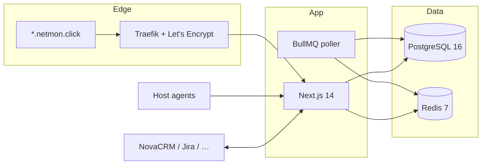

# Architecture



**Stack:** Next.js 14 App Router · Prisma 5 · PostgreSQL 16 · Redis 7 · BullMQ · NextAuth credentials · Tailwind · shadcn/ui · Framer Motion.

## Tenancy

- Cloud: tenant slug from `Host` (`acme.netmon.click` → `acme`).
- On-prem: still `tenant_id`, typically one tenant.
- Every Prisma query for tenant data uses `where: { tenant_id }`.
- Viewer never sees another tenant. AI is injected with that tenant’s data only.

## Poller

`worker/index.ts` repeats `pollAllDevices` every 60 seconds.

For each device:

1. TCP connect to the device IP (port 80, 2.5s timeout).
2. Write `metric` (CPU/RAM/disk jitter while up; zeros while down).
3. Update `sla.uptime_30d`.
4. If down and no firing `device_down` alert: create alert, notify channels, auto-open tickets.
5. If up and a firing `device_down` exists: resolve it and comment remote tickets.

## Secrets

Channel API keys and ticketing tokens are stored with `ENCRYPT_KEY` (`lib/crypto.ts`, AES-256-GCM, `enc:` prefix). UI always shows a mask after save.

## Layout

```
app/            Pages and API routes
components/     Shell, settings, tickets, topology
lib/            Auth, Prisma, poller, notify, tickets, AI
prisma/         Schema, migrations, seed
worker/         BullMQ poller
public/agent.sh Bootstrap heartbeat
```

## Settings

`/dashboard/settings` has three tabs: **Channels**, **Ticketing**, **AI integration**.
